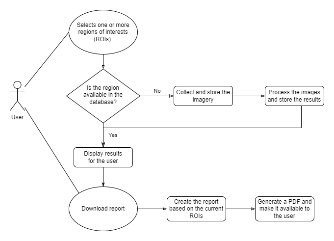

# RiverEye

Welcome! The RiverEye platform collects and displays riparian forests and vegetation alongside riverbanks, or the lack of them.

Riparian forests are essential for the life and maintanance of rivers. Natural causes and human interference can lead to
deforestation of the riparian zones which in turn affects fish and other organisms living in rivers which eventually can make the river
steril.

Due to the long extents of rivers and water bodies it is unfeasible to manually keep monitoring the riverbanks and properly protect those areas.
Moreover, landowners are required by governments to properly document such Permanent Preservation Areas (PPA) inside their properties, but still,
manually mapping all the PPA area may be cumbersome and prone to errors.

In order to solve the aforementioned shortcomings of the manual mapping process we developed the RiverEye platform. Our solution automatically
collects satellite imagery, analyses those images using State-Of-The-Art Deep Learning networks and provide rapidly the results of the analyses
for users. Furthermore our platform is easy to deploy, maintain and extend, by using Docker images one just need to clone our image from Docker hub and
run it. Using a modular approach the Geographic data, satellite imagery providers and Deep Learning networks can be easily replaced and adapted for
case-specific scenarios.

## How to deploy it?

The easiest way to deploy and run the RiverEye platform is by running our docker image with the commands:
```
docker run -d -it --name rivereye -p 127.0.0.1:8010:8000/tcp -w /root/rivereye/code/mainsettings/ --entrypoint /bin/bash arturandre/rivereye:1.0
docker exec -w /root/rivereye/code/mainsettings/ rivereyecontainer bash ./start-server.sh
```

These commands will clone the RiverEye docker image to the local host and create a container out of it which will be listening to the port `8010` (which may be 
changed depending on the user prefereces). After executing these lines one may access locally the platform using any internet browser at the address:

`http://localhost:8010/home`

Alternatively it is possible to deploy it manually without the use of docker. This requires:

  - downloading this repository via `https://github.com/arturandre/rivereye.git` 
  - Installing the following python packages (we recommend the usage of a conda environment with python 3.8)
    - the installation of [GeoDjango](https://docs.djangoproject.com/en/4.0/ref/contrib/gis/install/geolibs/)
    - the installation of `rasterio` and `osgeo` (preferably using a conda environment)
    - the installation of python packages (via `python -m pip install -r requirements`) at the `code/` directory
  - [Postgres](https://www.postgresql.org/download/) database with the [PostGIS](https://postgis.net/install/) extension.

After installing the required packages and softwares go to the directory `code/mainsetings` (not to be confused with `code/mainsetings/mainsetings` which correspond to the app not the project folder!), and initialize the database with the commands:

```
python manage.py makemigrations
python manage.py migrate
```

After initializing the database the last step is to run the server with the command:

`python manage.py runserver 0:8000`

Notice that the command-line parameter `0:8000` means that (`0`) the server will respond to requests originated by any IP address at the port `8000`. In the local computer where the server is deployed one may access it using any internet browser and going for the address `http://localhost:8000/home` .


## The architecture of the project

We employ the use of a server-client architecture. At the server side a Django based platform take user requests, manages the databases and provides responses for the users' requests. Besides that, scheduled services keep collecting asyncronously, satellite imagery and also keep processing those imagery in order to automatically detect rivers, water bodies, riparian and Permanent Preservation Areas. PPA areas that are violated (e.g. roads, buildings or bare soil near a river) are also detected and highlighted as irregular areas. The detection is performed by Deep Learning Networks fine-tuned with sattelite images annotatted at the pixel level.



### Image Collecting pipeline

### Deep Learning Network training and deployment pipeline

